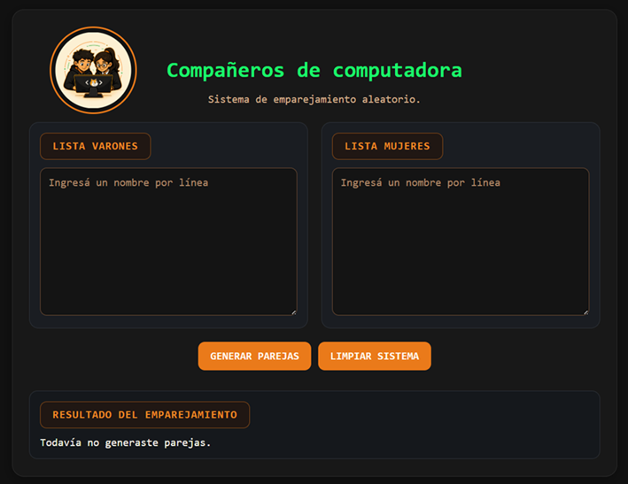
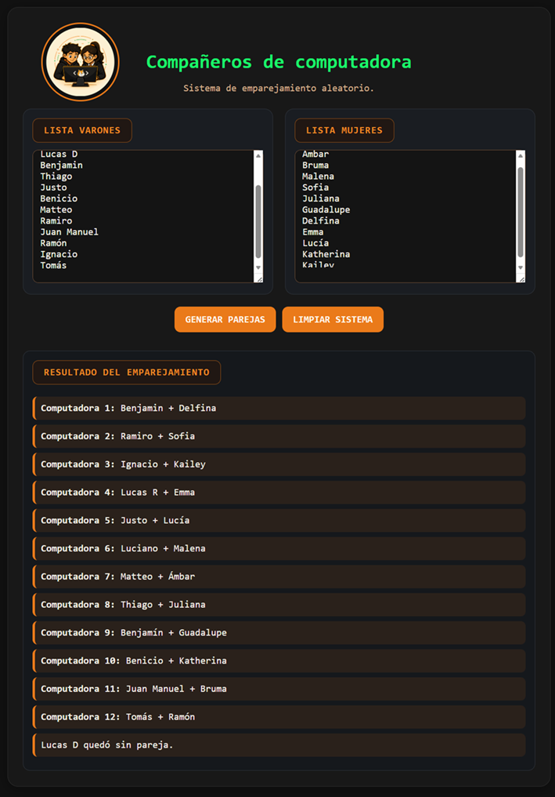
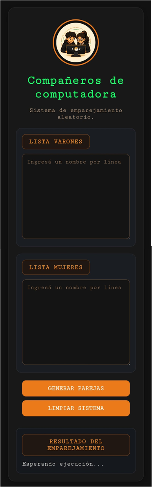

# Compañeros de computadora

Aplicación web sencilla para armar parejas aleatorias en el aula.


## Objetivo
Este proyecto fue pensado como una herramienta práctica para organizar compañeros de computadora para el aula de programación.


## Funcionalidades
- Permite ingresar una lista de varones y una lista de mujeres.
- Genera parejas aleatorias.
- Si sobran estudiantes, sigue armando parejas con quienes quedan.
- Permite limpiar los campos y volver a empezar.


## Tecnologías utilizadas
- HTML
- CSS
- JavaScript


## Estructura del proyecto

```
Compas-de-computadora/
├── index.html
├── style.css
├── script.js
├── README.md
└── imagenes/
    └── logo-chicos-en-compu.png
```

## Uso

1. Escribir un nombre por línea en cada lista.
2. Hacer clic en **Generar parejas**.
3. Ver el resultado en pantalla.


## Evidencias del proyecto

Durante el desarrollo del proyecto se registraron distintas instancias de trabajo, incluyendo:

* diseño y funcionamiento de la interfaz en computadora
* adaptación responsive para celular
* proceso de versionado en Git y GitHub
* publicación del proyecto en Vercel


## Capturas del proyecto

A continuación se presentan algunas vistas representativas de la aplicación, tanto en su versión de escritorio como en su adaptación para dispositivos móviles.

### 1. Vista general en escritorio

Interfaz principal de la aplicación antes de ingresar los nombres.



### 2. Generación de parejas en escritorio

Ejemplo de funcionamiento de la aplicación luego de cargar las listas y generar las parejas aleatorias.



### 3. Vista en celular

Versión responsive de la aplicación adaptada a pantalla móvil.




## Enlaces

* **Repositorio en GitHub:** [Compas-de-computadora](https://github.com/NatyBu26/Compas-de-computadora)
* **Sitio publicado en Vercel:** [Ver aplicación online](https://compas-de-computadora.vercel.app/)


## Uso de IA

Durante el desarrollo se utilizó asistencia de IA para:

* generar y ajustar el logo del proyecto
* acompañar mejoras visuales en la interfaz
* resolver detalles de maquetación responsive


## Autora
Naty Bu